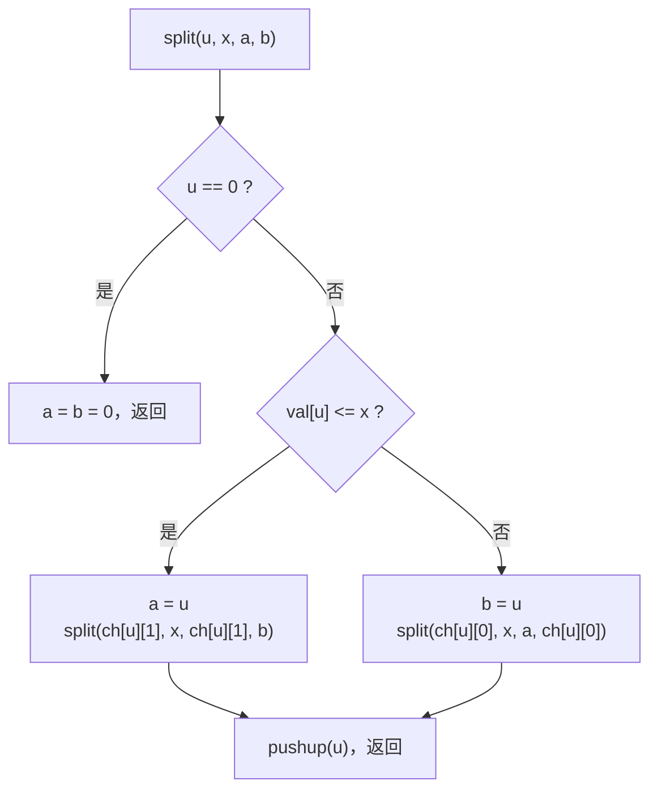
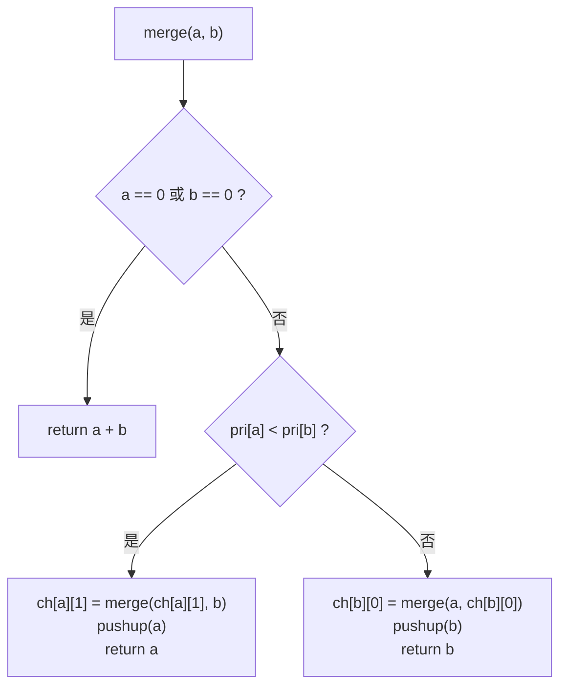
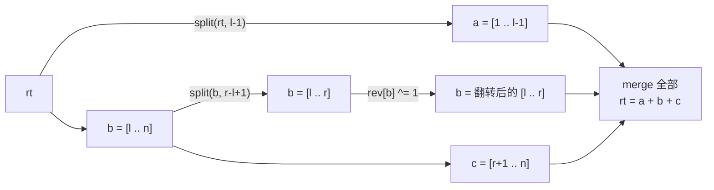
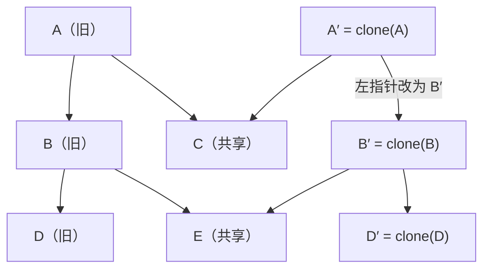

# FHQ Treap ：从普通平衡树到区间翻转与可持久化

> **配套源码（本仓库 `codes/` 目录）**
>
> | 文件 | 对应题目 | 内容 |
> |---|---|---|
> | `codes/P3369.cpp` | 洛谷 P3369 普通平衡树 | 本文逐函数精读的对象 |
> | `codes/P3391.cpp` | 洛谷 P3391 文艺平衡树 | 本文补充模块一：区间翻转 |
> | `codes/P3835.cpp` | 洛谷 P3835 可持久化平衡树 | 本文补充模块二：路径复制 |
>
> **关键词**：FHQ Treap · split / merge · 懒标记 · 路径复制 · 期望 O(log n)

---

## 0. 写在前面：这篇文章想讲清什么

FHQ Treap（范浩强 Treap）最迷人的地方在于：

- **没有旋转**。整棵树靠 **split（按某种规则拆分）** 和 **merge（合并）** 来维护；
- 插入、删除、排名、第 k 小、前驱、后继、区间翻转、可持久化……都是这两个操作的组合；
- 能在期望 $O(\log n)$ 时间内完成上述所有操作。

本文用「函数逐行精读」的方式展开：先逐函数拆解 `P3369.cpp` 的全部模块，再补充两大进阶模块——**区间翻转（文艺平衡树）** 与 **可持久化平衡树**。

---

## 1. 两条铁律：

1. **堆性质**：任意节点的 `pri` 小于两个儿子（小根堆）；
2. **BST 性质**：中序遍历按键值升序排列。

只要随机优先级独立均匀，树高的期望就是 $O(\log n)$——和第 3 节的图结合起来看，这就是它不用旋转也能平衡的全部秘密。

---

## 2. 数组变量定义

```cpp
#include <iostream>
#include <random>
using namespace std;

const int N = 1e5 + 10;      // 节点数组容量上限（比操作数多留一些空间）
int ch[N][2], val[N], sz[N]; // ch[u][0/1]：左/右儿子编号；val[u]：节点键值；sz[u]：以 u 为根的子树节点数
unsigned int pri[N];         // pri[u]：节点 u 的随机堆优先级，用于维持 Treap 的平衡
int root, tot;               // root：当前 Treap 根节点编号；tot：已分配的节点总数，也是新节点编号计数器
mt19937 rng(114514);         // 随机数生成器；固定种子使程序结果可复现
```

| 数组 / 变量 | 含义 | 备注 |
|---|---|---|
| `ch[u][0]` / `ch[u][1]` | 左儿子 / 右儿子编号 | `0` 表示空节点（哨兵） |
| `val[u]` | 节点键值 | BST 序按它决定 |
| `sz[u]` | 子树节点数 | 支持「第 k 小」等按大小导航 |
| `pri[u]` | 随机优先级 | 小根堆；用 `mt19937` 生成 |
| `root` | 当前根编号 | 所有操作从它出发 |
| `tot` | 节点池指针 | `newnode` 时自增，值即新节点编号 |

**`mt19937 rng(114514)` 固定种子**：保证每次运行结果可复现，对拍、调试都省事。`pri[u]` 声明成 `unsigned int`，直接装 `rng()` 的 32 位输出。

---

## 3. 基操：newnode / pushup / split / merge

### 3.1 newnode：申请一个叶子节点

```cpp
// 创建一个键值为 x 的新节点，并返回其节点编号。
int newnode(int x) // x：新节点保存的键值
{
    tot++;           // 分配一个从未使用过的节点编号
    val[tot] = x;    // 保存该节点的键值
    sz[tot] = 1;     // 新节点尚无儿子，子树大小为 1
    pri[tot] = rng();// 随机生成优先级，避免树形退化
    return tot;      // 返回新节点编号
}
```

新节点的左右儿子天然为 `0`（全局数组初值），所以只需设置 `val`、`sz`、`pri` 三样。

### 3.2 pushup：向上还账

```cpp
// 根据左右子树的大小，重新计算节点 u 的子树大小。
void pushup(int u) // u：需要更新子树大小的节点编号
{
    sz[u] = sz[ch[u][0]] + sz[ch[u][1]] + 1; // 左子树大小 + 右子树大小 + 当前节点
    return;
}
```

**子树大小 = 左子树大小 + 右子树大小 + 1**。凡是儿子被改动的节点，递归回溯时都要 `pushup` 一次。

### 3.3 split（按值拆）：<= x 归 a，> x 归 b

这是全篇的第一个核心。约定：`split(u, x, a, b)` 把以 `u` 为根的树拆成两棵，`a` 装所有**键值 <= x** 的节点，`b` 装所有**键值 > x** 的节点。

```cpp
// 按键值 x 将以 u 为根的树拆成两棵：a 中所有键值 <= x，b 中所有键值 > x。
void split(int u, int x, int& a, int& b) // u：待拆分树根；x：键值边界；a、b：通过引用返回的两棵树的根编号
{
    if (u == 0) // 空树拆分后仍是两棵空树
    {
        a = 0;
        b = 0;
        return;
    }
    if (val[u] <= x) // 当前节点属于左侧结果 a；只需继续拆它的右子树
    {
        a = u;
        split(ch[u][1], x, ch[u][1], b); // 拆分右子树，较小部分接回当前节点，较大部分作为 b
    }
    else // 当前节点属于右侧结果 b；只需继续拆它的左子树
    {
        b = u;
        split(ch[u][0], x, a, ch[u][0]); // 拆分左子树，较小部分作为 a，较大部分接回当前节点
    }
    pushup(u); // 子树结构改变后，更新当前节点的子树大小
    return;
}
```

**递归不变量**：进入 `split(u, ...)` 时，`u` 的整棵子树满足 BST 序；返回时，`a`、`b` 各自仍是合法 BST，且「a 全部 <= x < b 全部」。

**图解**：对下面这棵树做 `split(root, 9, a, b)`：

```text
初始（节点内为键值）:

              12
            /    \
           7      20
          / \    /
         3   10 15

① 12 > 9  => 12 归右树 b；继续拆 12 的左子树（以 7 为根）

② 7 <= 9  => 7 归左树 a；继续拆 7 的右子树（以 10 为根）

③ 10 > 9  => 10 归右树 b，作为 12 的左儿子；继续拆 10 的左子树（空）

④ 回溯：pushup(7)、pushup(12)

最终:
      a: 7                 b: 12
        /                    /  \
       3                   10    20
                                  /
                                 15
```

可见 split 只沿着「一条折线」往下走：每个节点只会往一个方向递归，另一棵子树**原封不动地整块归边**。所以单次 split 只碰 $O(\text{树高})$ 个节点。

**mermaid 流程图**：



### 3.4 merge：两棵有序树拼回一棵

约定：`merge(a, b)` 要求 **a 中所有键值 <= b 中所有键值**，返回合并后的根。谁当根由随机优先级决定——这就是「随机堆」维持平衡的关键。

```cpp
// 合并两棵树，要求 a 中所有键值均 <= b 中所有键值；返回合并后的根编号。
int merge(int a, int b) // a、b：待合并的两棵树的根节点编号
{
    if (a == 0 || b == 0) // 任意一棵树为空时，合并结果就是另一棵树
    {
        return a + b;
    }
    if (pri[a] < pri[b]) // a 的优先级更高，按堆性质由 a 作为合并后的根
    {
        ch[a][1] = merge(ch[a][1], b); // b 中的键值不小于 a，递归合并到 a 的右子树
        pushup(a);                     // 更新 a 的子树节点数
        return a;
    }
    else // b 的优先级更高，由 b 作为合并后的根
    {
        ch[b][0] = merge(a, ch[b][0]); // a 中的键值不大于 b，递归合并到 b 的左子树
        pushup(b);                     // 更新 b 的子树节点数
        return b;
    }
}
```

**图解**（设 `pri[7] < pri[12]`，即 7 优先级更高，小根堆）：

```text
   a: 7   3            b: 12  10  20  15

merge(a, b):
  根比较：pri[7] < pri[12]  => 7 当根
  ch[7][1] = merge(空, 12) = 12         （递归：一边为空直接返回）

结果:

        7
       / \
      3   12
         /  \
        10   20
             /
            15
```

**mermaid 流程图**：



### 3.5 为什么这样就能平衡、且中序不变

- **中序不变**：split 只是把沿路节点的某个儿子"剪掉换边"，左右子树的相对先后没变；merge 挂子树时也都挂在满足 BST 序的一侧。所以**任何时刻中序遍历都是键值升序**——这正是第 5 节「按排名定位区间」的基础。
- **期望平衡**：`pri` 独立随机，使得 merge 时"谁当根"完全随机化。可以证明这种随机 BST（随机构造等价于随机插序）树高期望 $O(\log n)$，于是所有沿树操作都是期望 $O(\log n)$。

---

## 4. P3369 六操作逐函数精读

先把「操作 → 实现」的总览摆出来，再逐条展开：

| 操作 | 洛谷编号 | 实现核心 | 是否改变树 |
|---|---|---|---|
| 插入 x | 1 | `split(root,x)` + `newnode` + 两段 `merge` | 是（永久） |
| 删除 x | 2 | 两次 split 切出 `== x` 段，摘掉其根再合并 | 是（永久） |
| 查询 x 排名 | 3 | split 法：`sz[a] + 1`；或迭代 `rnk` | 临时（拆完必合） |
| 查询第 x 小 | 4 | `kth`：按子树大小导航 | 否 |
| 前驱 | 5 | split 法取 a 末元素；或迭代 `pre` | 临时（拆完必合） |
| 后继 | 6 | split 法取 b 首元素；或迭代 `nxt` | 临时（拆完必合） |

### 4.1 操作 1 插入：split + newnode + merge

```cpp
if (op == 1) // 插入一个数 x
{
    int a, b;                               // a：所有 <= x 的节点；b：所有 > x 的节点
    split(root, x, a, b);                   // 为新节点找到按键值排序的插入位置
    root = merge(merge(a, newnode(x)), b);  // 插入新节点并合并回整棵树
}
```

三步走：

```text
原树  ──split(root, x)──▶  a(<=x)   b(>x)
a + 新节点 x  ──merge──▶  a'        （新节点天然排在 a 的最右侧合法位置）
a' + b        ──merge──▶  新树（中序仍是升序）
```

注意**插入是复制一份新节点**，所以 x 重复出现时树里就有多个相同键值，这为"删除只删一个"提供了语义基础。

### 4.2 操作 2 删除：两次 split 切出「等于段」

```cpp
else if (op == 2) // 删除一个数 x（题目保证 x 存在）
{
    int a, b, c;                        // a：键值 < x 的树；c：键值 == x 的节点树；b：键值 > x 的树
    split(root, x, a, b);               // 先把 <= x 与 > x 分开
    split(a, x - 1, a, c);              // 再把 < x 与 == x 分开；c 的根节点是一个待删除的 x
    c = merge(ch[c][0], ch[c][1]);      // 删除 c 的根节点，并合并其左右子树；若有重复值则其余节点保留
    root = merge(merge(a, c), b);       // 将小于 x、替代子树和大于 x 的部分依次合并
}
```

```text
原树 ──split(root, x)──▶ a(<=x)        b(>x)
a    ──split(a, x-1)──▶  a'(<x)        c(==x)
c    ──丢掉根节点，merge(ch[c][0], ch[c][1])──▶ c'（重复的 x 仍在 c' 中）
根 = merge(merge(a', c'), b)
```

`c = merge(ch[c][0], ch[c][1])` 这句是精髓：**只摘掉 c 的根，子树的其余节点原样保留**，于是多个相同的 x 只会被删掉一个。

### 4.3 操作 3 排名：原文件的 split 内联写法

```cpp
else if (op == 3) // 查询 x 的排名（排名从 1 开始）
{
    int a, b;                       // a：键值 < x；b：键值 >= x
    split(root, x - 1, a, b);       // 把所有小于 x 的元素分到 a
    cout << sz[a] + 1 << "\n";      // x 的排名 = 小于 x 的元素个数 + 1
    root = merge(a, b);             // 恢复完整 Treap
}
```

整数键值下 `split(root, x - 1, a, b)` 让 a 恰好就是「严格小于 x」的全部元素，排名就是 `sz[a] + 1`。**注意查询类操作拆完必须 merge 回去**（俗称"拆完必合"），否则树就被永久改变了。

**补充：独立函数版（免 split 的迭代导航）**

原文件把排名写在了 main 里，模块化程度不够；而且可持久化版本不能这么写（每次查询都会克隆 $O(\log n)$ 个节点）。所以补充一个迭代导航版：

```cpp
// 免 split 求排名：返回「严格小于 x 的个数 + 1」（重复元素取最小排名）
int rnk(int u, int x)
{
    int res = 1; // 排名从 1 开始
    while (u)
    {
        if (val[u] < x) // 当前节点以及它的整棵左子树都小于 x
        {
            res += sz[ch[u][0]] + 1;
            u = ch[u][1]; // 去右子树找更多更小的候选
        }
        else // 当前节点 >= x，只能往左走
        {
            u = ch[u][0];
        }
    }
    return res;
}
```

| 写法 | 是否改变树 | 需要 merge 复原 | 适用场景 |
|---|---|---|---|
| split 法（原文件） | 临时改变 | 是 | 代码直观，一遍就懂 |
| 迭代法 `rnk`（补充） | **完全不改变** | 否 | 可持久化必备；常数更小 |

### 4.4 操作 4 第 k 小：按子树大小导航

```cpp
// 查询以 u 为根的树中按键值升序排列的第 k 个元素（k 从 1 开始）。
int kth(int u, int k) // u：查询树的根节点；k：目标名次
{
    while (u) // 沿树查找，直到命中目标节点或走到空节点
    {
        if (k <= sz[ch[u][0]]) // 目标名次落在左子树中
        {
            u = ch[u][0];
        }
        else if (k == sz[ch[u][0]] + 1) // 左子树之后的第一个元素就是当前节点
        {
            return val[u];
        }
        else // 目标名次在右子树中，扣除左子树和当前节点的元素数
        {
            k -= sz[ch[u][0]] + 1;
            u = ch[u][1];
        }
    }
    return 0; // k 超出有效范围时的兜底返回值；题目保证查询合法
}

else if (op == 4) // 查询排名为 x 的数
{
    cout << kth(root, x) << "\n"; // 直接按子树大小查找第 x 小元素
}
```

导航规则一句话：**左子树不够就往左走，刚好越过左子树就是当前节点，否则扣掉左子树和当前节点后往右走**。同样只走 $O(\text{树高})$ 步。

### 4.5 操作 5 前驱：split 法与迭代法对照

原文件的 split 版：

```cpp
// 查询严格小于 x 的最大元素（前驱）。
int pre(int x) // x：查询边界
{
    int a, b;                   // a：键值 < x 的树；b：键值 >= x 的树
    split(root, x - 1, a, b);   // 按 x-1 拆分，整数键值下 a 恰好包含所有小于 x 的元素
    int res = kth(a, sz[a]);    // a 中最后一个元素即为前驱
    root = merge(a, b);         // 查询拆分后需合并回去，恢复完整 Treap
    return res;                 // 返回前驱值
}
```

补充的迭代版（P3835 中使用，不存在时返回极小值哨兵）：

```cpp
// 免 split 求前驱：严格小于 x 的最大值；不存在返回 -2147483647
int pre(int u, int x)
{
    int res = -2147483647;
    while (u)
    {
        if (val[u] < x) // 当前值是合法候选，先记下，再尝试更大的
        {
            res = val[u];
            u = ch[u][1];
        }
        else // 当前值 >= x，只能往左找更小的
        {
            u = ch[u][0];
        }
    }
    return res;
}
```

### 4.6 操作 6 后继：对称写法

```cpp
// 查询严格大于 x 的最小元素（后继）。
int nxt(int x) // x：查询边界
{
    int a, b;               // a：键值 <= x 的树；b：键值 > x 的树
    split(root, x, a, b);   // 按 x 拆分，b 中保存所有严格大于 x 的元素
    int res = kth(b, 1);    // b 中第一个元素即为后继
    root = merge(a, b);     // 查询拆分后需合并回去，恢复完整 Treap
    return res;             // 返回后继值
}
```

```cpp
// 免 split 求后继：严格大于 x 的最小值；不存在返回 2147483647
int nxt(int u, int x)
{
    int res = 2147483647;
    while (u)
    {
        if (val[u] > x) // 当前值是合法候选，先记下，再尝试更小的
        {
            res = val[u];
            u = ch[u][0];
        }
        else // 当前值 <= x，只能往右找更大的
        {
            u = ch[u][1];
        }
    }
    return res;
}
```

### 4.7 main：六操作的调度中心

```cpp
int main()
{
    int n; // 操作总数
    cin >> n;
    for (int i = 1; i <= n; i++) // 按输入顺序处理 n 条操作
    {
        int op, x; // op：操作类型（1~6）；x：插入/删除的数值或查询参数
        cin >> op >> x;
        // ...（六个分支见上文，此处省略）
    }
    return 0; // 程序正常结束
}
```

到这里，P3369 的全部模块讲完了。但我相信你和我一样，更想看到 FHQ Treap 真正"碾压旋转派"的两个场景——**区间翻转**和**可持久化**。下面两节就是本次补充的核心模块。

---

## 5. 补充模块一：区间翻转（文艺平衡树 P3391）

### 5.1 题目在问什么

维护一个序列 $1, 2, \dots, n$，每次把区间 $[l, r]$ 翻转，最后输出整个序列。

**关键洞察**：如果在 FHQ Treap 的每个节点上只放"它在序列中的位置"（即把中序位置当作键），那么「第 k 个」就是「第 k 小」——**树形完全不用动，只要把 [l, r] 对应的中序片段整体反过来即可**。于是：

- 建树：把序列位置 1..n 顺次 merge 进去（中序即原序列）；
- 翻转 [l, r]：把树按**排名**拆成 `[1, l-1]`、`[l, r]`、`[r+1, n]` 三段，给中间那段打上翻转标记，再合并回去。

### 5.2 与「按值 split」的对照：按排名 split

| | 按值 split（P3369） | 按排名 split（P3391） |
|---|---|---|
| 分界参数 | 键值 x | 前 k 个元素 |
| 判断依据 | `val[u] <= x` | `sz[ch[u][0]] >= k` |
| 递归时调整 | `x` 不变 | 右侧要减去 `sz[ch[u][0]] + 1` |
| 用途 | 排名、前驱后继、按值插入删除 | 区间操作、按位置拆段 |

```cpp
// 把以 u 为根的树按排名拆成两棵：a 装前 k 个元素，b 装其余。
void split(int u, int k, int& a, int& b)
{
    if (u == 0)
    {
        a = 0;
        b = 0;
        return;
    }
    pushdown(u); // 进入节点前先下传懒标记，保证左右儿子方向正确
    if (sz[ch[u][0]] >= k) // 左子树已有至少 k 个元素，分界点落在左子树里
    {
        b = u;
        split(ch[u][0], k, a, ch[u][0]); // 左子树的前 k 个归 a，其余接回 u 的左侧
    }
    else // 前 k 个包含「左子树 + 当前节点」以及右子树的一部分
    {
        a = u;
        split(ch[u][1], k - sz[ch[u][0]] - 1, ch[u][1], b); // 余额去右子树继续分
    }
    pushup(u);
    return;
}
```

### 5.3 rev 懒标记：O(1) 完成一次翻转

翻转一段序列 = 交换每个节点的左右儿子 + 递归下去。全做是 $O(\text{段长})$，太慢。于是像线段树一样打**懒标记**：

```cpp
void pushdown(int u)
{
    if (rev[u]) // 当前节点挂着翻转标记
    {
        swap(ch[u][0], ch[u][1]); // 交换左右儿子，等价于把中序反过来
        rev[ch[u][0]] ^= 1;       // 把标记下传给左儿子
        rev[ch[u][1]] ^= 1;       // 把标记下传给右儿子
        rev[u] = 0;               // 清掉自己的标记
    }
    return;
}
```

- 给一段树根 `b` 打标记：`rev[b] ^= 1;`——$O(1)$ 完事；
- **任何要走进某个节点的操作（split / merge / print）在进入前必须先 `pushdown(u)`**，否则它看到的是"没翻转前"的旧方向；
- 翻转两次等于没翻，所以用 `^= 1`。

### 5.4 翻转 [l, r] 的三步图解

```text
序列（中序）: 1 2 3 4 5        翻转 [2, 4]

① split(rt, l-1=1, a, b)
   a = [1]              b = [2 3 4 5]

② split(b, r-l+1=3, b, c)
   b = [2 3 4]          c = [5]

③ rev[b] ^= 1          给中间段打懒标记（对应中序反转 4 3 2）

④ rt = merge(a, merge(b, c))
   [1] + [4 3 2] + [5] = 1 4 3 2 5
```



### 5.5 完整代码（P3391）

```cpp
#include <iostream>
#include <random>
using namespace std;

const int N = 1e5 + 10;
int ch[N][2], val[N], sz[N], rev[N]; // 比 P3369 多一个 rev：翻转懒标记
unsigned int pri[N];
int rt, tot;
mt19937 rng(114514);

int newnode(int x)
{
    tot++;
    val[tot] = x;
    sz[tot] = 1;
    rev[tot] = 0; // 新节点没有标记
    pri[tot] = rng();
    return tot;
}

void pushup(int u)
{
    sz[u] = sz[ch[u][0]] + sz[ch[u][1]] + 1;
    return;
}

void pushdown(int u) // 与 P3369 相比多出的函数：下传翻转标记
{
    if (rev[u])
    {
        swap(ch[u][0], ch[u][1]); // 交换左右儿子
        rev[ch[u][0]] ^= 1;       // 标记下传
        rev[ch[u][1]] ^= 1;
        rev[u] = 0;               // 清除标记
    }
    return;
}

void split(int u, int k, int& a, int& b) // 按排名拆：a 装前 k 个
{
    if (u == 0)
    {
        a = 0;
        b = 0;
        return;
    }
    pushdown(u); // 关键：进节点先下传
    if (sz[ch[u][0]] >= k)
    {
        b = u;
        split(ch[u][0], k, a, ch[u][0]);
    }
    else
    {
        a = u;
        split(ch[u][1], k - sz[ch[u][0]] - 1, ch[u][1], b);
    }
    pushup(u);
    return;
}

int merge(int a, int b)
{
    if (a == 0 || b == 0)
    {
        return a + b;
    }
    if (pri[a] < pri[b])
    {
        pushdown(a); // 关键：进节点先下传
        ch[a][1] = merge(ch[a][1], b);
        pushup(a);
        return a;
    }
    else
    {
        pushdown(b);
        ch[b][0] = merge(a, ch[b][0]);
        pushup(b);
        return b;
    }
}

void print(int u) // 中序输出，读到一个节点先 pushdown 再递归
{
    if (u == 0)
    {
        return;
    }
    pushdown(u);
    print(ch[u][0]);
    cout << val[u] << " ";
    print(ch[u][1]);
    return;
}

int main()
{
    int n, m;
    cin >> n >> m;
    for (int i = 1; i <= n; i++)
    {
        rt = merge(rt, newnode(i)); // 依次 merge，中序即 1..n
    }
    for (int i = 1; i <= m; i++)
    {
        int l, r;
        cin >> l >> r;
        int a, b, c;
        split(rt, l - 1, a, b);     // a = [1, l-1]
        split(b, r - l + 1, b, c);  // b = [l, r]，c = [r+1, n]
        rev[b] ^= 1;                // 打翻转标记
        rt = merge(a, merge(b, c)); // 合并回整棵树
    }
    print(rt); // 中序输出最终序列
    cout << "\n";
    return 0;
}
```

**实测**：官方样例 `5 3 / 1 3 / 1 3 / 1 4` 输出 `4 3 2 1 5` ✓；200 组随机数据与暴力 `std::reverse` 对拍全部通过。

### 5.6 易混点提醒

- 按排名 split 的第二个参数是**元素个数**，不是位置；`split(b, r - l + 1, ...)` 里的 `r - l + 1` 千万别写成 `r`。
- 打标记给的是**段的根**（即使它是懒的），不是所有节点；标记会在之后每次 pushdown 时逐层生效。
- `print` 也必须 pushdown，否则翻转没生效就输出，结果错得很隐蔽。

---

## 6. 补充模块二：可持久化（P3835）

### 6.1 可持久化平衡树在做什么

维护若干**历史版本**：每次操作基于某个旧版本 `v` 进行，产生新版本 `i`；之后的查询可以回到任意版本。即我们需要一棵「改不坏」的树：每次修改不破坏旧版本，而是**新增一条 O(log n) 的复制路径**。

这正好落在 FHQ Treap 的舒适区：它的修改只发生在 split / merge 的**一条路径**上。

### 6.2 路径复制（persistent path copying）

```text
版本 v 的树片段:

        A
       / \
      B   C
     / \
    D   E

假设本次 split 沿路径 A -> B -> D 走:

- 途中每个节点都先 clone 出一个副本：A' = clone(A)，B' = clone(B)，D' = clone(D)
- 副本之间重新挂接；没有走到的子树（C、E）直接共享引用，不复制
- 旧版本 A/B/D 一个字节都不改，仍完整可用
```



于是：**单次操作新增约 $O(\log n)$ 个节点，旧版本零改动**。

### 6.3 clone：复制一个节点

```cpp
// 复制节点 u 的全部信息，返回新节点编号；原节点保持原样
int clone(int u)
{
    tot++;
    ch[tot][0] = ch[u][0]; // 儿子照抄
    ch[tot][1] = ch[u][1];
    val[tot] = val[u];
    sz[tot] = sz[u];
    pri[tot] = pri[u];     // 优先级必须一致，否则堆性质都变了
    return tot;
}
```

### 6.4 split / merge 的改写点

与 P3369 相比，只差一件事：**凡是要改动节点的位置，先 clone 再改**。

```cpp
void split(int u, int x, int& a, int& b)
{
    if (u == 0)
    {
        a = 0;
        b = 0;
        return;
    }
    if (val[u] <= x)
    {
        a = clone(u);                      // 不再直接拿 u，而是先复制
        split(ch[a][1], x, ch[a][1], b);   // 之后所有修改都落在副本 a 上
        pushup(a);
    }
    else
    {
        b = clone(u);
        split(ch[b][0], x, a, ch[b][0]);
        pushup(b);
    }
    return;
}

int merge(int a, int b)
{
    if (a == 0 || b == 0)
    {
        return a + b;
    }
    if (pri[a] < pri[b])
    {
        int c = clone(a);                  // 先复制再挂接
        ch[c][1] = merge(ch[a][1], b);
        pushup(c);
        return c;
    }
    else
    {
        int c = clone(b);
        ch[c][0] = merge(a, ch[b][0]);
        pushup(c);
        return c;
    }
}
```

> 注意 `merge` 里递归调用传的是 `ch[a][1]`（原来的孩子）而不是 `ch[c][1]`（副本的孩子）——两者此刻内容相同，但语义上我们要合并的是"原树的右子树"，写 `ch[a][1]` 更不易错。

### 6.5 版本数组与操作约定

```cpp
const int N = 5e5 + 10; // 版本数（每次操作产生一个版本，外加初始版本 0）
const int M = 5e7 + 10; // 节点池：路径复制会产生海量新节点
int ch[M][2], val[M], sz[M];
unsigned int pri[M];
int rt[N], tot;         // rt[v]：版本 v 的根编号
```

主循环：读入 `v op x`，表示"基于版本 v 执行 op x"，操作完成后**形成版本 i**：

```cpp
for (int i = 1; i <= n; i++)
{
    int v, op, x;
    cin >> v >> op >> x;
    if (op == 1) // 插入
    {
        int a, b;
        split(rt[v], x, a, b);
        rt[i] = merge(merge(a, newnode(x)), b); // 新版本的根
    }
    else if (op == 2) // 删除（不存在则忽略）
    {
        if (rnk(rt[v], x) == rnk(rt[v], x + 1)) // 版本 v 中没有 x
        {
            rt[i] = rt[v]; // 忽略：直接继承旧根，不产生新节点
        }
        else
        {
            int a, b, c;
            split(rt[v], x, a, b);
            split(a, x - 1, a, c);
            c = merge(ch[c][0], ch[c][1]); // 摘掉一个 x
            rt[i] = merge(merge(a, c), b);
        }
    }
    else if (op == 3) // 查询排名（免 split，零复制）
    {
        cout << rnk(rt[v], x) << "\n";
        rt[i] = rt[v];
    }
    // ... 4/5/6 同理
}
```

**版本继承的两个细节**：

1. **查询类操作（3/4/5/6）不修改树**，新版本直接 `rt[i] = rt[v]` 共享整棵树——零新节点；
2. **删除不存在时**同样直接继承旧根。判断存在性用的是 `rnk(rt[v], x) == rnk(rt[v], x + 1)`：不存在 x 的话，x 与 x+1 之间没有元素，两者排名相同。

### 6.6 查询为什么必须用「免 split 迭代版」

试想用 split 法做一次「排名查询」：拆一次要 clone 一条路径，合回去又要 clone 两条路径，$O(\log n)$ 个新节点凭空产生。$5 \times 10^5$ 次查询下节点池瞬间爆炸！

所以可持久化版本里，**所有只读查询都改用第 4 节补充的迭代函数**：

```cpp
int rnk(int u, int x);  // 严格小于 x 的个数 + 1
int kth(int u, int k);  // 第 k 小（判越界后调用）
int pre(int u, int x);  // 严格小于 x 的最大值，不存在返回 -2147483647
int nxt(int u, int x);  // 严格大于 x 的最小值，不存在返回 2147483647
```

主循环中查询分支：

```cpp
else if (op == 4) // 查询排名为 x 的数
{
    if (sz[rt[v]] < x) // 版本 v 里元素不足 x 个，按约定输出极大值
    {
        cout << 2147483647 << "\n";
    }
    else
    {
        cout << kth(rt[v], x) << "\n";
    }
    rt[i] = rt[v];
}
else if (op == 5)
{
    cout << pre(rt[v], x) << "\n";
    rt[i] = rt[v];
}
else // op == 6
{
    cout << nxt(rt[v], x) << "\n";
    rt[i] = rt[v];
}
```

**本题答案约定汇总**（与洛谷 P3835 相符）：

| 情况 | 输出 |
|---|---|
| 前驱不存在 | `-2147483647` |
| 后继不存在 | `2147483647` |
| op4 排名 x 超出元素个数 | `2147483647` |
| op2 删除不存在的数 | 忽略该操作，版本直接继承 |

### 6.7 空间与常数估算

单节点内存 = `ch` 8B + `val` 4B + `sz` 4B + `pri` 4B = **20 B**。

| 规模（n = 5e5） | 实测节点数 | 本地耗时（g++ -O2） |
|---|---|---|
| 25 万插入 + 25 万删除 | ≈ 2.74e7 | ≈ 3.0 s |
| 50 万插入 | ≈ 2.90e7 | ≈ 3.0 s |

节点池取 `M = 5e7 + 10`，即 `5e7 × 20B = 1GB`，在洛谷 P3835 的 1.5 GB 内存限制内（题面注明"正常常数的可持久化平衡树均可通过"）。本地实测内存占用 420 MB 以上，属正常水平。

> 小技巧：若也想省内存，可以把 `val` 压成 `int` 之外的东西、或改用"随机优先级用节点编号哈希生成"以省掉 `pri` 数组；不过对本题而言 `M = 5e7` 已经安全。

---

## 7. 复杂度与易错点总表

**复杂度**（n 为操作数，树高期望 $O(\log n)$）：

| 操作 | 时间 | 空间（单次） |
|---|---|---|
| 插入 / 删除 | 期望 $O(\log n)$ | P3369：1 个新节点；P3835：+O(log n) 克隆 |
| 排名 / 第 k 小 / 前驱 / 后继 | 期望 $O(\log n)$（迭代版常数更小） | 迭代版 0 |
| 区间翻转 [l, r] | 期望 $O(\log n)$（两次 split + 两次 merge + O(1) 打标记） | 0 |
| 可持久化单次操作 | 期望 $O(\log n)$ | +O(log n) 个节点 |

**易错点清单**：

| 易错点 | 说明 |
|---|---|
| split 的差一 | 排名/前驱用 `x - 1`，后继用 `x`；按排名 split 的参数是"个数"而非"下标" |
| 拆完必合 | split 法查询（排名/前驱/后继）之后必须 `merge` 回去 |
| 重复元素 | 插入照常复制新节点；删除只摘掉一个（`merge` 被删节点的左右子树） |
| kth 越界 | 普通版题目保证合法；可持久化版先判 `sz[rt[v]] < x` |
| pushdown 时机 | 翻转树中 split / merge / print 进入节点**第一件事**就是 pushdown |
| 按值 / 按排名混用 | 两套 split 参数含义不同，不能互相调用；P3391 全篇按排名 |
| 递归深度 | 树高期望 $O(\log n)$，随机优先级正常时不会爆栈 |
| 数组大小 | P3391 每序列元素一个节点；P3835 必须给节点池留 5e7 级别 |
| 固定种子 | `mt19937 rng(114514)` 让结果可复现，对拍省心 |
| 迭代查询崩溃风险 | 迭代版 `rnk/kth/pre/nxt` 必须传"当前版本的根"，别误传全局 root |

---

## 8. 附录：三份完整代码

### 附录 A：P3369 普通平衡树

```cpp
#include <iostream>
#include <random>
using namespace std;

const int N = 1e5 + 10;
int ch[N][2], val[N], sz[N];
unsigned int pri[N];
int root, tot;
mt19937 rng(114514);

int newnode(int x)
{
    tot++;
    val[tot] = x;
    sz[tot] = 1;
    pri[tot] = rng();
    return tot;
}

void pushup(int u)
{
    sz[u] = sz[ch[u][0]] + sz[ch[u][1]] + 1;
    return;
}

void split(int u, int x, int& a, int& b)
{
    if (u == 0)
    {
        a = 0;
        b = 0;
        return;
    }
    if (val[u] <= x)
    {
        a = u;
        split(ch[u][1], x, ch[u][1], b);
    }
    else
    {
        b = u;
        split(ch[u][0], x, a, ch[u][0]);
    }
    pushup(u);
    return;
}

int merge(int a, int b)
{
    if (a == 0 || b == 0)
    {
        return a + b;
    }
    if (pri[a] < pri[b])
    {
        ch[a][1] = merge(ch[a][1], b);
        pushup(a);
        return a;
    }
    else
    {
        ch[b][0] = merge(a, ch[b][0]);
        pushup(b);
        return b;
    }
}

int kth(int u, int k)
{
    while (u)
    {
        if (k <= sz[ch[u][0]])
        {
            u = ch[u][0];
        }
        else if (k == sz[ch[u][0]] + 1)
        {
            return val[u];
        }
        else
        {
            k -= sz[ch[u][0]] + 1;
            u = ch[u][1];
        }
    }
    return 0;
}

int pre(int x)
{
    int a, b;
    split(root, x - 1, a, b);
    int res = kth(a, sz[a]);
    root = merge(a, b);
    return res;
}

int nxt(int x)
{
    int a, b;
    split(root, x, a, b);
    int res = kth(b, 1);
    root = merge(a, b);
    return res;
}

int main()
{
    int n;
    cin >> n;
    for (int i = 1; i <= n; i++)
    {
        int op, x;
        cin >> op >> x;
        if (op == 1)
        {
            int a, b;
            split(root, x, a, b);
            root = merge(merge(a, newnode(x)), b);
        }
        else if (op == 2)
        {
            int a, b, c;
            split(root, x, a, b);
            split(a, x - 1, a, c);
            c = merge(ch[c][0], ch[c][1]);
            root = merge(merge(a, c), b);
        }
        else if (op == 3)
        {
            int a, b;
            split(root, x - 1, a, b);
            cout << sz[a] + 1 << "\n";
            root = merge(a, b);
        }
        else if (op == 4)
        {
            cout << kth(root, x) << "\n";
        }
        else if (op == 5)
        {
            cout << pre(x) << "\n";
        }
        else
        {
            cout << nxt(x) << "\n";
        }
    }
    return 0;
}
```

### 附录 B：P3391 文艺平衡树（区间翻转）

见第 5.5 节完整代码。

### 附录 C：P3835 可持久化平衡树

```cpp
#include <iostream>
#include <random>
using namespace std;

const int N = 5e5 + 10;
const int M = 5e7 + 10;
int ch[M][2], val[M], sz[M];
unsigned int pri[M];
int rt[N], tot;
mt19937 rng(114514);

int newnode(int x)
{
    tot++;
    ch[tot][0] = 0;
    ch[tot][1] = 0;
    val[tot] = x;
    sz[tot] = 1;
    pri[tot] = rng();
    return tot;
}

int clone(int u)
{
    tot++;
    ch[tot][0] = ch[u][0];
    ch[tot][1] = ch[u][1];
    val[tot] = val[u];
    sz[tot] = sz[u];
    pri[tot] = pri[u];
    return tot;
}

void pushup(int u)
{
    sz[u] = sz[ch[u][0]] + sz[ch[u][1]] + 1;
    return;
}

void split(int u, int x, int& a, int& b)
{
    if (u == 0)
    {
        a = 0;
        b = 0;
        return;
    }
    if (val[u] <= x)
    {
        a = clone(u);
        split(ch[a][1], x, ch[a][1], b);
        pushup(a);
    }
    else
    {
        b = clone(u);
        split(ch[b][0], x, a, ch[b][0]);
        pushup(b);
    }
    return;
}

int merge(int a, int b)
{
    if (a == 0 || b == 0)
    {
        return a + b;
    }
    if (pri[a] < pri[b])
    {
        int c = clone(a);
        ch[c][1] = merge(ch[a][1], b);
        pushup(c);
        return c;
    }
    else
    {
        int c = clone(b);
        ch[c][0] = merge(a, ch[b][0]);
        pushup(c);
        return c;
    }
}

int kth(int u, int k)
{
    while (u)
    {
        if (k <= sz[ch[u][0]])
        {
            u = ch[u][0];
        }
        else if (k == sz[ch[u][0]] + 1)
        {
            return val[u];
        }
        else
        {
            k -= sz[ch[u][0]] + 1;
            u = ch[u][1];
        }
    }
    return 0;
}

int rnk(int u, int x)
{
    int res = 1;
    while (u)
    {
        if (val[u] < x)
        {
            res += sz[ch[u][0]] + 1;
            u = ch[u][1];
        }
        else
        {
            u = ch[u][0];
        }
    }
    return res;
}

int pre(int u, int x)
{
    int res = -2147483647;
    while (u)
    {
        if (val[u] < x)
        {
            res = val[u];
            u = ch[u][1];
        }
        else
        {
            u = ch[u][0];
        }
    }
    return res;
}

int nxt(int u, int x)
{
    int res = 2147483647;
    while (u)
    {
        if (val[u] > x)
        {
            res = val[u];
            u = ch[u][0];
        }
        else
        {
            u = ch[u][1];
        }
    }
    return res;
}

int main()
{
    int n;
    cin >> n;
    for (int i = 1; i <= n; i++)
    {
        int v, op, x;
        cin >> v >> op >> x;
        if (op == 1)
        {
            int a, b;
            split(rt[v], x, a, b);
            rt[i] = merge(merge(a, newnode(x)), b);
        }
        else if (op == 2)
        {
            if (rnk(rt[v], x) == rnk(rt[v], x + 1))
            {
                rt[i] = rt[v];
            }
            else
            {
                int a, b, c;
                split(rt[v], x, a, b);
                split(a, x - 1, a, c);
                c = merge(ch[c][0], ch[c][1]);
                rt[i] = merge(merge(a, c), b);
            }
        }
        else if (op == 3)
        {
            cout << rnk(rt[v], x) << "\n";
            rt[i] = rt[v];
        }
        else if (op == 4)
        {
            if (sz[rt[v]] < x)
            {
                cout << 2147483647 << "\n";
            }
            else
            {
                cout << kth(rt[v], x) << "\n";
            }
            rt[i] = rt[v];
        }
        else if (op == 5)
        {
            cout << pre(rt[v], x) << "\n";
            rt[i] = rt[v];
        }
        else
        {
            cout << nxt(rt[v], x) << "\n";
            rt[i] = rt[v];
        }
    }
    return 0;
}
```

---

## 9. 参考资料

- 洛谷 P3369【模板】普通平衡树
- 洛谷 P3391【模板】文艺平衡树
- 洛谷 P3835【模板】可持久化平衡树
- 范浩强《FHQ Treap 介绍》（IOI 中国国家候选队论文系列讲座资料）
- cppreference：`std::mt19937`、`std::swap`

> 结语：FHQ Treap 的学习曲线非常"陡峭但短暂"——split 与 merge 的递归不变量想通之后，排名、第 k 小、前驱后继是"按大小导航"，区间翻转是"按排名拆段 + 懒标记"，可持久化是"先 clone 再改"。所有进阶玩法都只是这两块积木的不同拼法，这也是它比旋转平衡树更值得先学的原因。
